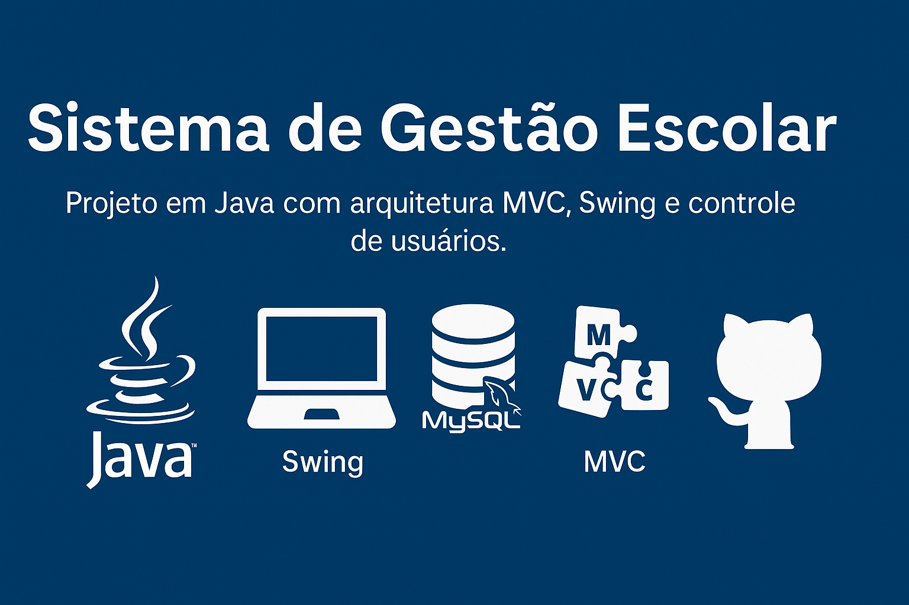

<p align="center">
  
</p>

# 🎓 Sistema de Gestão Escolar

Este é um projeto de sistema de gestão escolar municipal, desenvolvido em **Java**, com interface gráfica em **Swing** e estrutura baseada na arquitetura **MVC**.  
O sistema permite o gerenciamento de alunos, professores, turmas, notas e frequência, com controle de acesso por tipo de usuário.

---

## 🧰 Tecnologias Utilizadas

- ✅ Java (JDK 17+)
- ✅ Swing (interface gráfica)
- ✅ MVC (Model - View - Controller)
- ✅ SHA-256 para criptografia de senha
- ✅ Git e GitHub

---

## ⚙️ Funcionalidades

- Login com controle de perfil (admin, diretor, professor, secretário)
- Cadastro de professores, turmas e usuários
- Matrícula de alunos em turmas
- Lançamento de notas e frequência
- Edição de perfil com alteração de senha
- Navegação com botões "Voltar" e "Meu Perfil"
- Interface elegante, visual e centralizada

---

## 🗂️ Estrutura de Pastas

```
/model           -> Classes de domínio (Aluno, Turma, Nota, etc.)
/controller      -> Lógicas de controle e comunicação entre View e Model
/view            -> Interfaces gráficas Swing
/util            -> Utilitários (ex: criptografia SHA-256)
/dao             -> Acesso a dados (CRUD)
```

---

## 🧑‍💻 Autor

**Sidney Lobato**  
GitHub: [@SidneyLobato](https://github.com/SidneyLobato)

---

## 📝 Licença

Este projeto é de uso acadêmico e educacional.  
Você pode utilizá-lo e adaptá-lo livremente para fins de estudo.
